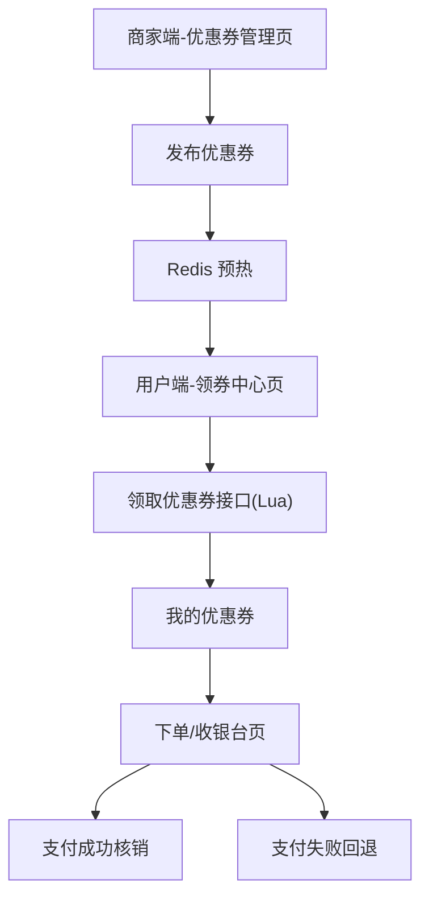

## 1. Product Overview
优惠券模块用于“商家发布优惠券、用户高并发抢券、下单核销与支付失败回退”。
目标是在高并发场景下保证库存一致性、可追溯性与用户体验稳定。

## 2. Core Features

### 2.1 User Roles
| 角色 | 注册/接入方式 | Core Permissions |
|------|---------------|------------------|
| 商家运营 | 作为已有商家后台账号登录 | 创建/发布/下线优惠券；触发 Redis 预热；查看发放与核销统计 |
| 普通用户 | 作为已有用户账号登录 | 浏览可领优惠券；Lua 抢券；查看我的券；下单使用与回退 |

### 2.2 Feature Module
我们的优惠券需求由以下主要页面组成：
1. **商家端-优惠券管理页**：优惠券模板编辑、发布/下线、Redis 预热、发放/核销统计。
2. **用户端-领券中心页**：可领券列表、领券（Lua 原子校验+扣减）、我的优惠券。
3. **下单/收银台页**：可用券推荐、用券锁定、支付成功核销、支付失败回退。

### 2.3 Page Details
| Page Name | Module Name | Feature description |
|-----------|-------------|---------------------|
| 商家端-优惠券管理页 | 模板编辑 | 创建/编辑优惠券模板：名称、面额/折扣、门槛、总库存、单人限领、有效期、适用范围(店铺/品类/商品)、叠加规则、状态草稿/已发布/已下线。 |
| 商家端-优惠券管理页 | 发布与预热 | 发布时校验参数；生成模板ID；写入数据库；将模板与库存/限领规则预热到 Redis；失败可重试并记录原因。 |
| 商家端-优惠券管理页 | 上下线与统计 | 下线后用户端不可再领；展示已发放数、剩余库存、核销数、回退数、异常数；支持按时间筛选。 |
| 用户端-领券中心页 | 可领券列表 | 拉取“可领模板”列表（按有效期、状态、库存、用户限领过滤）；展示面额、门槛、有效期、适用范围与剩余量提示。 |
| 用户端-领券中心页 | 抢券（核心） | 点击领取时调用 Lua：原子校验模板可领、库存>0、未超限；原子扣减库存并写入“待落库”队列；返回领取成功/失败原因。 |
| 用户端-领券中心页 | 我的优惠券 | 展示用户已领取券：未使用/已锁定/已使用/已过期；显示使用规则；支持到下单页一键使用。 |
| 下单/收银台页 | 用券与锁定 | 根据订单金额与适用范围计算可用券；用户选择后创建“锁定”记录（防并发重复使用）；展示折扣后应付金额。 |
| 下单/收银台页 | 支付成功核销 | 支付成功后将锁定券置为已使用；记录核销时间、订单号；写入核销流水。 |
| 下单/收银台页 | 支付失败回退 | 支付失败/超时/取消时，释放锁定：券回到可用状态；记录回退原因；确保幂等与可重试。 |

## 3. Core Process
**商家运营流程**：进入优惠券管理页 → 创建/编辑模板 → 点击发布 → 系统写库并 Redis 预热（模板、库存、限领）→ 用户端立即可见 → 运营可下线/查看统计。

**用户领券流程**：进入领券中心 → 选择优惠券 → 调用抢券接口 → Redis Lua 原子校验并扣减库存、写入异步落库消息 → 返回领取结果 → 异步消费者落库后“我的优惠券”可见。

**下单用券流程**：进入下单页 → 系统计算可用券 → 用户选择券 → 锁定券（避免并发使用）→ 支付成功则核销；支付失败/取消则回退释放。

