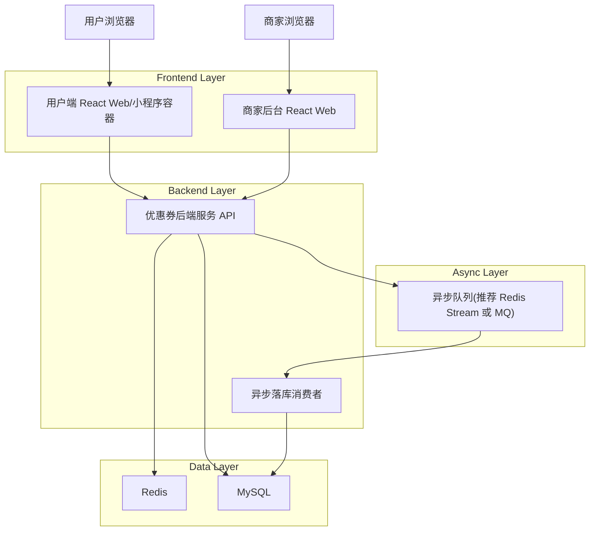
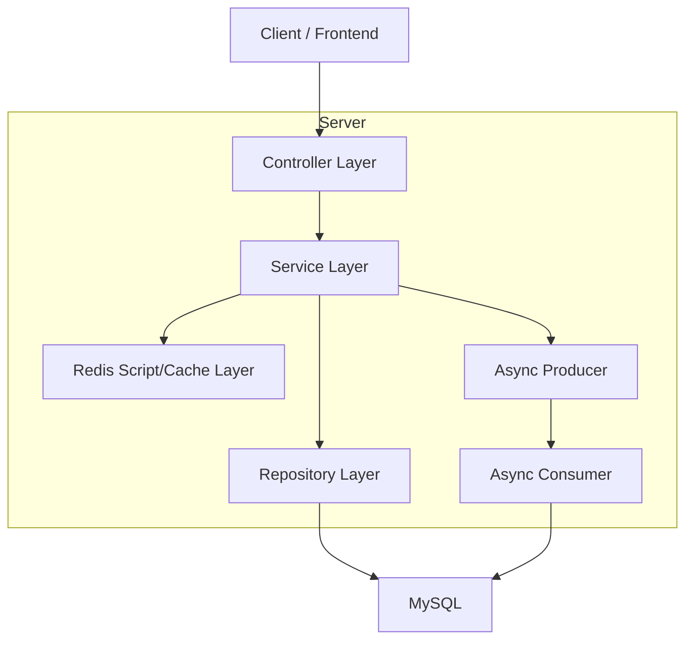
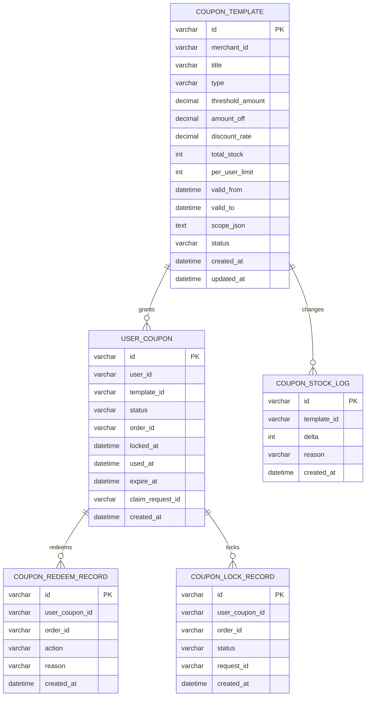

## 1.Architecture design


## 2.Technology Description
- Frontend: React@18 + TypeScript + Vite + tailwindcss@3
- Backend: Java Spring Boot@3（或 Node.js@20 + NestJS@10，二选一落地）
- Database: MySQL@8
- Cache/Atomic: Redis@7（Lua 脚本 + Hash/String/Set + Stream/List）
- Async: Redis Stream（轻量）或 RabbitMQ/Kafka（如已有中台）

## 3.Route definitions
| Route | Purpose |
|-------|---------|
| /admin/coupons | 商家端优惠券管理页：模板列表、编辑、发布/下线、统计 |
| /coupons | 用户端领券中心：可领券列表、我的优惠券入口 |
| /checkout | 下单/收银台：选券、锁券、支付结果处理 |

## 4.API definitions (If it includes backend services)
### 4.1 Core Types (TypeScript)
```ts
export type CouponTemplateStatus = "DRAFT" | "PUBLISHED" | "OFFLINE";
export type UserCouponStatus = "AVAILABLE" | "LOCKED" | "USED" | "EXPIRED";

export interface CouponTemplate {
  id: string;
  merchantId: string;
  title: string;
  type: "AMOUNT" | "DISCOUNT";
  thresholdAmount: number; // 0 表示无门槛
  amountOff?: number;
  discountRate?: number; // 0~1
  totalStock: number;
  perUserLimit: number;
  validFrom: string;
  validTo: string;
  scopeJson: string; // 适用范围(店铺/品类/商品)
  status: CouponTemplateStatus;
}

export interface ClaimCouponRequest {
  templateId: string;
  requestId: string; // 幂等
}
export interface ClaimCouponResponse {
  ok: boolean;
  code: "OK" | "OUT_OF_STOCK" | "EXCEED_LIMIT" | "NOT_ACTIVE" | "DUPLICATE";
  userCouponId?: string; // 可能延迟返回(异步落库)
}

export interface LockCouponRequest {
  orderId: string;
  userCouponId: string;
  requestId: string;
}
```

### 4.2 Merchant APIs
- POST /api/admin/coupon-templates
- PUT /api/admin/coupon-templates/{id}
- POST /api/admin/coupon-templates/{id}/publish  （含 Redis 预热）
- POST /api/admin/coupon-templates/{id}/offline
- GET /api/admin/coupon-templates/{id}/stats

### 4.3 User APIs
- GET /api/coupons/available
- POST /api/coupons/claim  （Redis Lua 抢券）
- GET /api/coupons/mine

### 4.4 Order/Payment APIs
- POST /api/checkout/coupons/recommend
- POST /api/checkout/coupons/lock
- POST /api/checkout/coupons/confirm-used   （支付成功回调/业务确认）
- POST /api/checkout/coupons/release-lock   （支付失败/取消/超时回退）

## 5.Server architecture diagram (If it includes backend services)


## 6.Data model(if applicable)
### 6.1 Data model definition


### 6.2 Data Definition Language
Coupon Template (coupon_template)
```sql
CREATE TABLE coupon_template (
  id VARCHAR(32) PRIMARY KEY,
  merchant_id VARCHAR(32) NOT NULL,
  title VARCHAR(128) NOT NULL,
  type VARCHAR(16) NOT NULL,
  threshold_amount DECIMAL(10,2) NOT NULL DEFAULT 0,
  amount_off DECIMAL(10,2) NULL,
  discount_rate DECIMAL(6,4) NULL,
  total_stock INT NOT NULL,
  per_user_limit INT NOT NULL,
  valid_from DATETIME NOT NULL,
  valid_to DATETIME NOT NULL,
  scope_json TEXT NOT NULL,
  status VARCHAR(16) NOT NULL,
  created_at DATETIME NOT NULL,
  updated_at DATETIME NOT NULL
);
CREATE INDEX idx_coupon_template_merchant ON coupon_template(merchant_id);
CREATE INDEX idx_coupon_template_status_time ON coupon_template(status, valid_from, valid_to);
```

User Coupon (user_coupon)
```sql
CREATE TABLE user_coupon (
  id VARCHAR(32) PRIMARY KEY,
  user_id VARCHAR(32) NOT NULL,
  template_id VARCHAR(32) NOT NULL,
  status VARCHAR(16) NOT NULL,
  order_id VARCHAR(32) NULL,
  locked_at DATETIME NULL,
  used_at DATETIME NULL,
  expire_at DATETIME NOT NULL,
  claim_request_id VARCHAR(64) NOT NULL,
  created_at DATETIME NOT NULL
);
CREATE INDEX idx_user_coupon_user_status ON user_coupon(user_id, status);
CREATE UNIQUE INDEX uk_user_coupon_claim_req ON user_coupon(claim_request_id);
```

Coupon Lock Record (coupon_lock_record)
```sql
CREATE TABLE coupon_lock_record (
  id VARCHAR(32) PRIMARY KEY,
  user_coupon_id VARCHAR(32) NOT NULL,
  order_id VARCHAR(32) NOT NULL,
  status VARCHAR(16) NOT NULL,
  request_id VARCHAR(64) NOT NULL,
  created_at DATETIME NOT NULL
);
CREATE UNIQUE INDEX uk_lock_req ON coupon_lock_record(request_id);
CREATE INDEX idx_lock_order ON coupon_lock_record(order_id);
```

Redeem Record (coupon_redeem_record)
```sql
CREATE TABLE coupon_redeem_record (
  id VARCHAR(32) PRIMARY KEY,
  user_coupon_id VARCHAR(32) NOT NULL,
  order_id VARCHAR(32) NULL,
  action VARCHAR(16) NOT NULL,  -- CLAIM/LOCK/USED/RELEASE
  reason VARCHAR(64) NULL,
  created_at DATETIME NOT NULL
);
CREATE INDEX idx_redeem_user_coupon ON coupon_redeem_record(user_coupon_id);
```

Stock Log (coupon_stock_log)
```sql
CREATE TABLE coupon_stock_log (
  id VARCHAR(32) PRIMARY KEY,
  template_id VARCHAR(32) NOT NULL,
  delta INT NOT NULL,
  reason VARCHAR(64) NOT NULL,
  created_at DATETIME NOT NULL
);
CREATE INDEX idx_stocklog_template ON coupon_stock_log(template_id);
```

## 7.Redis 预热、Lua 抢券与异步落库（实现要点）
### 7.1 Redis Key 约定
- 模板详情：coupon:tpl:{templateId} (Hash)
- 库存：coupon:stock:{templateId} (String/int)
- 用户已领数量：coupon:ucnt:{templateId}:{userId} (String/int)
- 异步落库队列：coupon:claim:stream (Stream) 或 coupon:claim:list (List)

### 7.2 商家发布 + Redis 预热
发布接口在同一业务事务中完成：
1) DB 写入/更新 coupon_template 状态为 PUBLISHED；2) 写入 coupon_stock_log；3) 写入 Redis：模板 Hash + 初始化库存 + perUserLimit 等；4) 失败则可重试（以 templateId 为幂等键）。

### 7.3 用户端 Lua 抢券（原子校验 + 扣减 + 入队）
Lua 原子步骤建议：
- 校验模板状态与有效期（从 Hash 取字段）
- 校验库存 > 0
- 校验用户领取数量 < perUserLimit
- DECR 库存、INCR 用户计数
- XADD/LPUSH 写入异步消息：templateId/userId/requestId/ts
- 返回码（OUT_OF_STOCK/EXCEED_LIMIT/NOT_ACTIVE/OK）

### 7.4 异步落库
消费者从 Stream/MQ 拉取消息，做：
- 以 requestId 幂等（user_coupon.uk_claim_request_id）
- 插入 user_coupon（AVAILABLE，expire_at=模板 valid_to）
- 追加 coupon_redeem_record(action=CLAIM)
- 失败重试；多次失败进死信并告警（不回补库存，需人工处理/补偿任务）。

### 7.5 下单使用与支付失败回退
- 锁券：将 user_coupon 从 AVAILABLE -> LOCKED（携带 order_id/locked_at），写 coupon_lock_record 与 redeem_record(action=LOCK)。
- 成功核销：LOCKED -> USED，写 USED 记录。
- 失败回退：LOCKED -> AVAILABLE（清空 order_id/locked_at），写 RELEASE 记录。
- 全链路幂等：所有写操作带 requestId，并在 DB 层做唯一键兜底；支付回调可能重复，必须按状态机忽略重复变更。