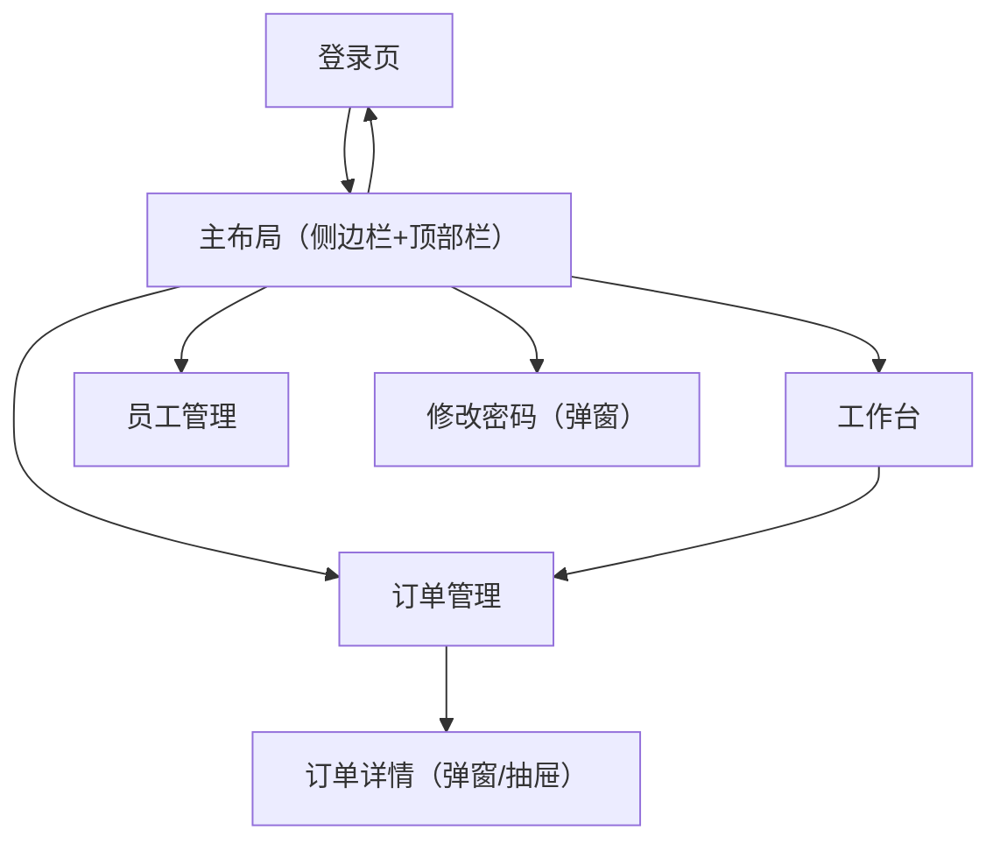

## 1. Product Overview
对照原 Vue 管理端实现，补齐并修复 React 管理端的关键交互与展示差异。
目标是让核心业务流程（登录-工作台-订单处理-基础管理）在体验与功能上与原版一致。

## 2. Core Features

### 2.1 User Roles
| Role | Registration Method | Core Permissions |
|------|---------------------|------------------|
| 管理员/员工账号 | 使用既有账号密码登录（后端鉴权签发 token） | 访问管理端功能；按后端权限控制可见与可操作内容 |

### 2.2 Feature Module
本次修复涉及以下核心页面：
1. **登录页**：账号/密码登录；错误提示与跳转一致性。
2. **主布局（侧边栏+顶部栏）**：营业状态展示与切换；用户菜单（修改密码/退出）。
3. **工作台**：今日数据、订单概览与待处理订单快捷入口（对齐原 Vue 信息密度与交互）。
4. **订单管理**：筛选、列表操作；订单详情结构化展示与快捷处理。
5. **员工管理**：列表查询/分页；启用禁用/提示交互对齐。

### 2.3 Page Details
| Page Name | Module Name | Feature description |
|-----------|-------------|---------------------|
| 登录页 | 登录表单默认值与校验提示（问题#1） | 取消默认预填账号/密码，初始为空；校验规则与原 Vue 一致（账号必填、密码长度等）；登录失败在表单区域与 Toast 给出明确原因。**验收**：1) 首次打开不出现默认账号/密码；2) 账号/密码为空时不发请求且出现红色校验提示；3) 后端返回失败时出现与原版一致的错误提示文案样式与位置；4) 成功后按 redirect 返回原访问页。 |
| 主布局（RootLayout） | 营业状态设置（问题#2） | 顶部展示当前营业状态（如“营业中/打烊中”）；点击“营业状态设置”打开确认/选择交互，并调用原 Vue 已使用的营业状态查询/切换接口；切换成功后立即刷新状态与提示。**验收**：1) 刷新页面后状态与后端一致；2) 切换需二次确认；3) 切换成功 Toast 提示，状态标签即时更新；4) 请求失败有明确错误提示且状态不被错误切换。 |
| 主布局（RootLayout） | 用户下拉菜单与修改密码（问题#3） | 点击用户名按钮弹出下拉菜单：修改密码、退出登录；修改密码使用弹窗（原 Vue password.vue 的交互对齐）：旧密码/新密码/确认密码，校验一致；成功后提示并按原版策略要求重新登录或关闭弹窗。**验收**：1) 下拉菜单可打开/关闭（点击空白关闭）；2) 修改密码校验不通过不提交；3) 修改成功提示明确；4) 退出登录清理 token 并跳转登录页。 |
| 工作台 | 信息密度与快捷处理入口对齐（问题#4） | 对齐原 Vue 工作台的核心模块：今日数据概览、订单概览（待接单/待派送/派送中/已完成/已取消）、菜品/套餐统计，以及“待处理订单列表”或等效快捷入口；点击统计项可跳转到订单管理并自动带入对应状态筛选。**验收**：1) 工作台至少呈现原版同等关键指标与模块；2) 点击“待接单”等能跳转到订单页并自动选中对应 Tab/筛选；3) 待处理订单支持一键查看详情并进行接单/拒单/取消等（或跳转后可完成同等操作）。 |
| 订单管理 | 订单详情结构化展示（问题#5） | 订单详情弹窗/抽屉对齐原 Vue：基本信息（订单号/状态/时间/金额）、收货信息、菜品明细列表、备注/取消原因等；按订单状态展示可用操作按钮（接单/拒单/取消/派送/完成），操作后刷新列表与详情状态。**验收**：1) 不再以 raw JSON 形式展示；2) 字段与原版一致（缺失字段需给“-”占位）；3) 操作按钮随状态正确显隐；4) 操作成功后列表与详情同步更新；5) 详情支持 URL 参数直达（带 orderId）并可正常关闭回到列表。 |

## 3. Core Process
- 管理员访问任意管理页：若未登录则跳转登录页；登录成功后返回原目标页面。
- 管理员在顶部栏查看当前营业状态：点击“营业状态设置”进行切换，确认后提交并提示结果。
- 管理员在工作台查看今日数据与待处理订单：点击“待接单/待派送”等卡片进入订单管理对应 Tab；在列表或详情中完成接单/拒单/取消/派送/完成。
- 管理员点击用户名：可进入修改密码弹窗或退出登录。

