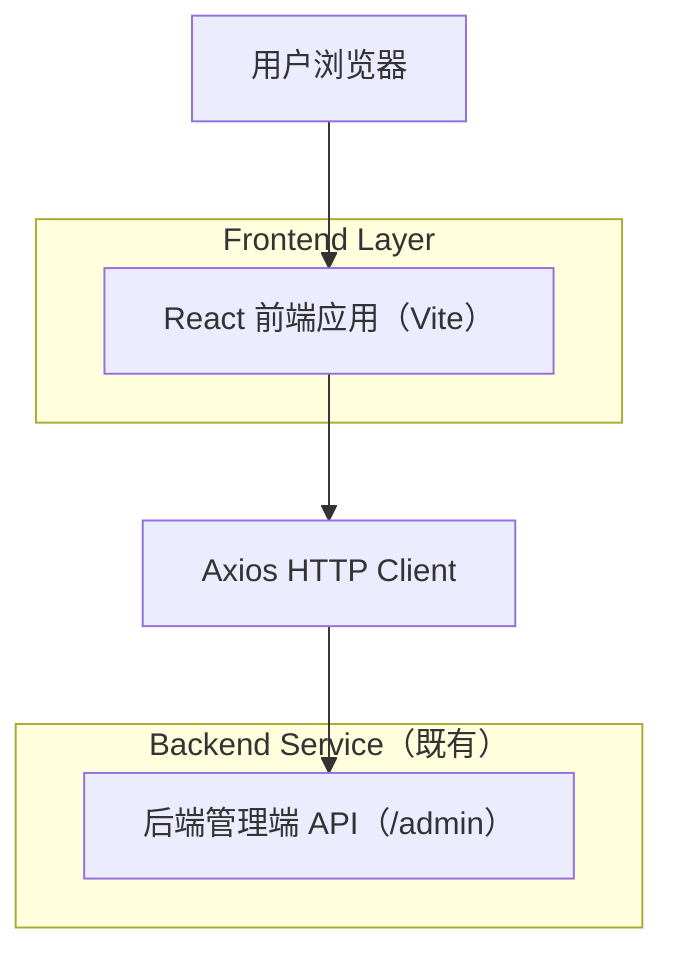

## 1.Architecture design

## 2.Technology Description
- Frontend: React@19 + react-router-dom@7 + TypeScript@5
- UI: antd@6（部分页面保留 legacy-vue 样式/结构组件用于对齐视觉）
- Networking: axios@1（封装于 src/lib/http/request.ts）
- Charts: echarts@6 + echarts-for-react@3（统计页）
- Auth: js-cookie@3（token/username 存储与读取）
- Backend: None（直接对接既有后端管理端 API）

## 3.Route definitions
| Route | Purpose |
|-------|---------|
| /login | 登录页（支持 redirect 回跳） |
| /dashboard | 工作台（今日数据与概览） |
| /statistics | 数据统计（图表报表） |
| /order | 订单管理（列表+详情） |
| /setmeal | 套餐管理（列表） |
| /setmeal/add | 套餐新增/编辑（query: id） |
| /dish | 菜品管理（列表） |
| /dish/add | 菜品新增/编辑（query: id） |
| /category | 分类管理（列表） |
| /employee | 员工管理（列表） |
| /employee/add | 员工新增/编辑（query: id） |
| /404 | 404 页面 |

## 4.API definitions (If it includes backend services)
无（本项目不新增自建后端，仅对接既有后端接口）。

## 6.Data model(if applicable)
无（数据模型由既有后端提供与约束）。
